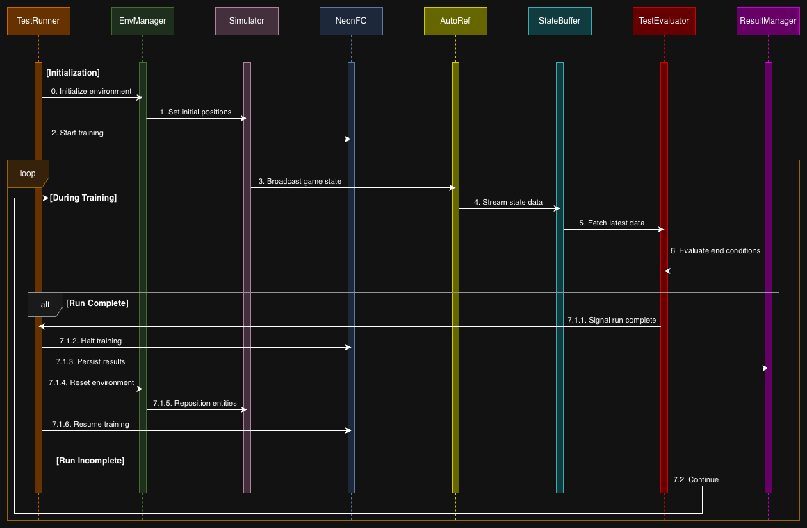

# LyNCh

LyNCh is a testing framework for orchestrating and evaluating robotic soccer simulations in NeonFC, designed to support training of **Deep Reinforcement Learning (DRL)** models. It provides configurable test scenarios, automated run management, and comprehensive metrics collection for iterative RL training workflows.

## Features

- **Configurable End Conditions**: Define custom criteria for episode termination based on game state
- **Automated Control**: Send play/halt signals to NeonFC to control DRL training sessions
- **Metrics Persistence**: Gather and store episode results in JSONL format with CSV export for reward analysis
- **Environment Management**: Reset and reinitialize environments between training episodes
- **Parameter Randomization**: Apply variance to scenario parameters using Strategy pattern (deterministic, uniform random, gaussian) for domain randomization
- **Test Configuration Management**: Load and manage training scenarios from JSON configs

## Architecture
```
┌─────────────────────────────────────────────────────────────────┐
│                           Cooper                                │
│  (Orchestrates workflow, coordinates all components)            │
└─────────────────────────────────────────────────────────────────┘
         │              │              │              │
         ▼              ▼              ▼              ▼
┌─────────────┐ ┌─────────────┐ ┌─────────────┐ ┌─────────────┐
│  LogLady    │ │    Giant    │ │   Diane     │ │    Hawk     │
│             │ │             │ │             │ │             │
│ - Polls     │ │ - Checks    │ │ - JSONL     │ │ - Loads     │
│   AutoRef   │ │   end con-  │ │   storage   │ │   scenarios │
│ - Thread-   │ │   ditions   │ │ - CSV       │ │ - Applies   │
│   safe      │ │ - Signals   │ │   export    │ │   variance  │
│   queue     │ │   completion│ │             │ │             │
└─────────────┘ └─────────────┘ └─────────────┘ └─────────────┘
```

### Components
| Component   | Responsibility                                                                                                             |
|-------------|----------------------------------------------------------------------------------------------------------------------------|
| **Cooper**  | Orchestrates the training workflow, manages component lifecycle, coordinates responses to episode completion               |
| **LogLady** | Maintains a thread-safe queue with the latest state from AutoRef                                                           |
| **Giant**   | Evaluates episode end conditions; abstract base class extended by specific evaluation types (e.g., `PenaltyKickEvaluator`) |
| **Diane**   | Handles episode result persistence as JSONL with query capabilities and CSV export                                         |
| **Hawk**    | Initializes environments, loads scenarios, applies variance strategies for domain randomization                            |

## Project Structure
```
LyNCh/
├── README.md
├── LICENSE
├── test_config.json              # Test scenario configurations
├── scenarios/                    # Scenario position files
├── lynch/                        # Main package
│   ├── cooper.py                 # Main orchestrator (instantiates all components)
│   ├── loglady/                  # StateBuffer - polls AutoRef, maintains state queue
│   ├── giant/                    # TestEvaluator - base class + specific evaluators
│   ├── diane/                    # ResultManager - JSONL storage, CSV export
│   └── hawk/                     # EnvManager - scenario loading, variance strategies
└── tests/                        # Test suite
```

## Configuration
### Test Config (`test_config.json`)
Defines scenarios with initial positions, variance settings, and evaluator types:

```json
{
    "scenarios": [
        {
            "id": "penalty_kick",
            "initial_pos_file": "scenarios/penalty_kick_positions.json",
            "distribution": {
                "strategy": "uniform_random",
                "variance": {
                    "ball": {"x": {"min": -0.2, "max": 0.2}},
                    "robots": {
                        "yellow": {
                            "0": {"theta": {"min": -0.1, "max": 0.1}}
                        }
                    }
                }
            },
            "evaluator": "PenaltyKickEvaluator"
        }
    ]
}
```

### Scenario Positions (`scenarios/*.json`)
Defines deterministic default positions:

```json
{
    "ball": {"x": 0.0, "y": 0.0, "z": 0.0},
    "robots": {
        "blue": [],
        "yellow": [
            {"id": 0, "x": -2.0, "y": 0.0, "theta": 0.0, "role": "keeper"},
            {"id": 1, "x": 3.0, "y": 0.0, "theta": 3.14, "role": "striker"}
        ]
    }
}
```

## Variance Strategies
| Strategy                 | Description                                               |
|--------------------------|-----------------------------------------------------------|
| `DeterministicStrategy`  | No variance; uses exact config values                     |
| `UniformRandomStrategy`  | Samples from uniform distribution within specified bounds |
| `GaussianRandomStrategy` | Samples from Gaussian distribution around base values     |

## Output Format
Results are stored as JSONL with the following structure:

```json
{
    "run_id": "run_001",
    "timestamp": "2026-03-03T10:30:00",
    "evaluator": "PenaltyKickEvaluator",
    "test_version": "1.0",
    "test_config": {...},
    "results": {
        "success": true,
        "final_state": {...}
    }
}
```

CSV export provides a queryable index of runs with columns: `run_id`, `timestamp`, `evaluator`, `success`.

## Data Flow


## License
See [LICENSE](LICENSE) for details.
